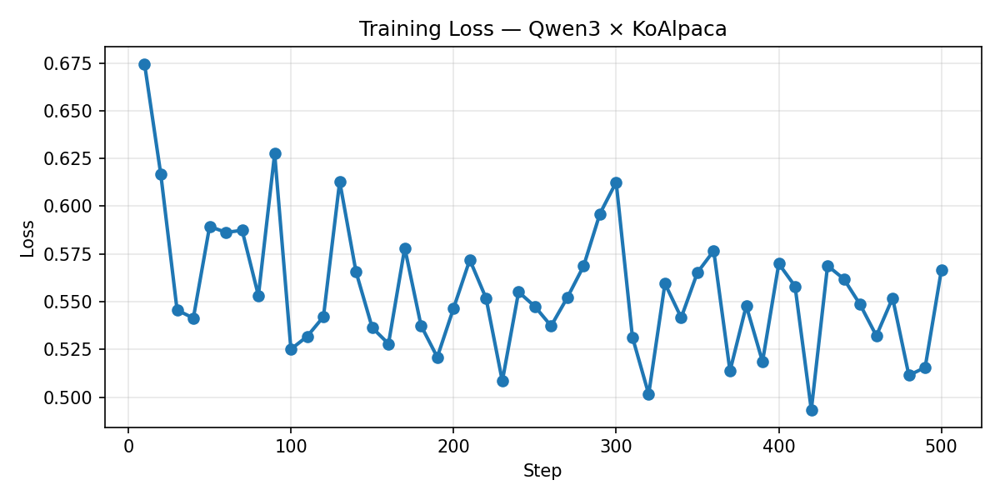
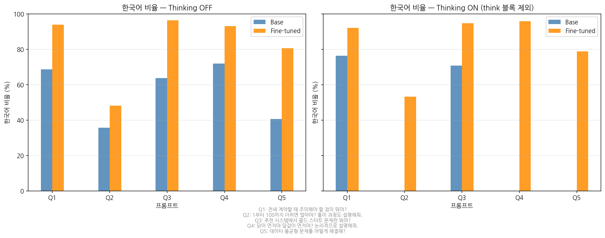
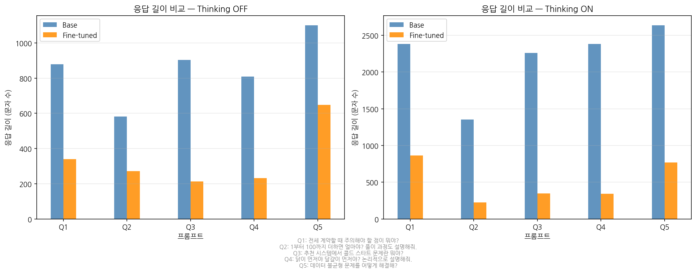

# 🔧 qwen3-lora-finetuning

> **2025-1학기 자연어처리 수업**  
> **Qwen3-14B × KoAlpaca** — LoRA 기반 한국어 instruction following 파인튜닝 실험

---

## 목차

1. [실험 목적](#1-실험-목적)
2. [기술 스택](#2-기술-스택)
3. [실험 환경](#3-실험-환경)
4. [프로젝트 구조](#4-프로젝트-구조)
5. [실행 방법](#5-실행-방법)
   - 5.1 [환경 설정](#51-환경-설정)
   - 5.2 [노트북 실행 순서](#52-노트북-실행-순서)
6. [모델 아키텍처](#6-모델-아키텍처)
   - 6.1 [GQA (Grouped Query Attention)](#61-gqa-grouped-query-attention)
   - 6.2 [SwiGLU FFN](#62-swiglu-ffn)
   - 6.3 [Thinking Mode](#63-thinking-mode)
7. [LoRA 설정](#7-lora-설정)
   - 7.1 [하이퍼파라미터 및 설계 근거](#71-하이퍼파라미터-및-설계-근거)
   - 7.2 [파라미터 절감 효과](#72-파라미터-절감-효과)
8. [데이터 Mixture 설계](#8-데이터-mixture-설계)
   - 8.1 [혼합 근거](#81-혼합-근거)
   - 8.2 [데이터셋 상세](#82-데이터셋-상세)
9. [학습 설정](#9-학습-설정)
10. [평가 결과](#10-평가-결과)
    - 10.1 [Loss Curve](#101-loss-curve)
    - 10.2 [정량 평가 — 한국어 비율](#102-정량-평가--한국어-비율)
    - 10.3 [정성 평가 — Before / After 비교](#103-정성-평가--before--after-비교)
    - 10.4 [Thinking 언어 관찰](#104-thinking-언어-관찰)
11. [한계 및 후속 연구](#11-한계-및-후속-연구)
    - 11.1 [현재 한계](#111-현재-한계)
    - 11.2 [후속 연구 방향](#112-후속-연구-방향)
12. [참고 자료](#12-참고-자료)

---

## 1. 실험 목적

Qwen3-14B는 동일한 모델에서 추론 과정을 출력하는 Thinking mode와 즉시 답변하는 Non-thinking mode를 모두 지원한다.
본 실험은 이 두 모드를 활용해 아래 두 가지를 확인한다.

1. **한국어 instruction following 강화**: 영어 중심 사전학습 모델에 한국어 데이터를 파인튜닝하면 한국어 응답 품질이 얼마나 개선되는가?
2. **Thinking 언어 혼용 현상**: 한국어로 질문했을 때 `<think>` 태그 내부 추론 과정이 영어로 출력되는가, 한국어로 출력되는가? 파인튜닝 후 어떻게 변화하는가?

---

## 2. 기술 스택

| 구분 | 도구 | 용도 |
|------|------|------|
| 기반 모델 | Qwen3-14B (Alibaba Cloud) | 파인튜닝 대상 LLM |
| 파인튜닝 | Unsloth + PEFT (LoRA) | 2x 속도 향상, LoRA 어댑터 학습 |
| 학습 프레임워크 | TRL SFTTrainer | Supervised Fine-Tuning 학습 루프 |
| 데이터 처리 | Hugging Face Datasets | 데이터셋 로드 및 포맷 변환 |
| 시각화 | Matplotlib + koreanize-matplotlib | Loss Curve, 평가 그래프 |
| 실험 환경 | RunPod GPU Cloud (H100 80GB) | 클라우드 GPU 서버 |

---

## 3. 실험 환경

| 항목 | 내용 |
|------|------|
| GPU 서버 | RunPod (GPU Cloud) |
| GPU 모델 | NVIDIA H100 80GB HBM3 |
| VRAM | 79.2 GB |
| CUDA 버전 | 12.8 |
| PyTorch 버전 | 2.10.0+cu128 |
| 총 학습 시간 | 29.9분 |
| 프레임워크 | Unsloth 2026.4.2 + TRL SFTTrainer |
| 기반 모델 | `unsloth/Qwen3-14B` (4bit 양자화) |

---

## 4. 프로젝트 구조

```
qwen3-lora-finetuning/
├── finetuning.ipynb        # 메인 실험 노트북
├── figures/
│   ├── loss_curve.png      # 학습 Loss Curve
│   ├── korean_ratio.png    # 한국어 비율 비교 (Base vs Fine-tuned)
│   └── response_length.png # 응답 길이 비교 (Base vs Fine-tuned)
├── base_results.json       # Base 모델 응답 raw data (자동 생성)
├── ft_results.json         # Fine-tuned 모델 응답 raw data (자동 생성)
├── lora_model/             # 저장된 LoRA 어댑터 (자동 생성)
│   ├── adapter_config.json
│   └── adapter_model.safetensors
└── README.md
```

---

## 5. 실행 방법

### 5.1 환경 설정

```bash
# RunPod PyTorch 템플릿 권장 (CUDA 12.4+, Container Disk 50GB 이상)
git clone https://github.com/gogolucj/qwen3-lora-finetuning
cd qwen3-lora-finetuning
pip install -r requirements.txt
jupyter notebook finetuning.ipynb
```

> **주의**: Container Disk는 최소 50GB 이상 설정을 권장한다.  
> Qwen3-14B 모델 가중치(~9GB) + 패키지 + 캐시를 합산하면 30GB 이상 필요하다.

### 5.2 패키지 목록

| 패키지 | 버전 | 용도 |
|--------|------|------|
| unsloth | 2026.4.4 | LoRA 학습 및 4-bit 추론 최적화 |
| datasets | 4.3.0 | HuggingFace 데이터셋 로드 |
| trl | 0.24.0 | SFTTrainer 학습 루프 |
| accelerate | 1.13.0 | 분산 학습 / 혼합 정밀도 |
| bitsandbytes | 0.49.2 | 4-bit / 8-bit 양자화 |
| peft | 0.18.1 | LoRA 어댑터 저장·로드 |
| transformers | 5.5.0 | 모델·토크나이저 |
| huggingface_hub | 1.9.0 | HuggingFace Hub 업로드 |
| matplotlib | 3.10.8 | Loss Curve, 평가 그래프 |
| numpy | 2.4.0 | 수치 계산 |
| pandas | 3.0.2 | 데이터 혼합 처리 |

### 5.2 노트북 실행 순서
```
Cell 1   GPU 환경 확인  → 실험 환경 섹션 수치 확인용
Cell 2   패키지 설치  → unsloth, datasets, trl, matplotlib
Cell 3   모델 로드  → Qwen3-14B 4bit 양자화 로드
Cell 4   LoRA 설정  → rank=32, target_modules 설정
Cell 5   데이터 준비  → OpenMathReasoning + KoAlpaca 혼합
Cell 6   Base 응답 저장
Cell 7   학습  → 500 steps, 약 30분 (H100 기준)
Cell 8   Loss Curve 저장  → figures/loss_curve.png
Cell 9   Fine-tuned 응답 생성  → ft_results.json 저장
Cell 10  Before/After 비교  → 응답 전문 출력
Cell 11  한국어 비율 정량 평가  → figures/korean_ratio.png, response_length.png
Cell 12  모델 저장  → lora_model/ 디렉터리
```

> **Cell 6 주의**: Base 응답 저장은 학습 전에 반드시 실행해야 한다.  
> 학습 후에는 가중치가 변경되어 Base 응답을 재현할 수 없다.

---

## 6. 모델 아키텍처

Qwen3-14B는 Decoder-only Transformer 구조를 기반으로 하며, GQA, SwiGLU FFN, RoPE 위치 인코딩 등을 채택한다.  
아래는 본 실험과 직접적으로 관련된 핵심 설계 요소를 정리한다.

### 6.1 GQA (Grouped Query Attention)

```
num_attention_heads  = 40  (Q 헤드)
num_key_value_heads  = 8   (K/V 헤드)
```

**KV Cache란**

Transformer는 추론 시 이전 토큰들의 Key, Value를 매번 재계산하지 않고 저장해두고 재사용한다.

```
토큰 1 생성 → K1, V1 저장
토큰 2 생성 → K1, V1 재사용 + K2, V2 저장
토큰 3 생성 → K1, V1, K2, V2 재사용 + K3, V3 저장
...
```

문장이 길어질수록 캐시가 누적되어 메모리를 많이 차지한다.

**MHA vs GQA 메모리 비교**

```
MHA : Q 헤드 40개, K 헤드 40개, V 헤드 40개 → KV Cache 40쌍 분량
GQA : Q 헤드 40개, K 헤드  8개, V 헤드  8개 → KV Cache  8쌍 분량
```

K/V 헤드를 40개 → 8개로 줄이면 KV Cache가 **1/5 수준**으로 감소한다.  
Q 헤드는 줄이지 않는다. Q는 "무엇을 찾을지"를 결정하는 헤드라 다양성이 중요하며,  
K/V는 여러 Q 헤드가 공유해도 품질 손실이 크지 않다는 게 실험적으로 검증됐다.

**실제 메모리 절감 수치** (시퀀스 길이 2048, bfloat16 기준)

```
MHA (K/V 헤드 40개) : 40 × 128 dim × 2048 토큰 × 2(K+V) × 2 bytes ≈ 40GB
GQA (K/V 헤드  8개) :  8 × 128 dim × 2048 토큰 × 2(K+V) × 2 bytes ≈  8GB
```

KV Cache만으로 약 32GB 절약. 긴 문맥이나 배치 추론에서 특히 효과가 크다.

### 6.2 SwiGLU FFN

```
기존 FFN : Linear → ReLU → Linear
SwiGLU  : (Linear × SiLU(Linear)) → Linear
```

SwiGLU는 FFN에 게이팅 메커니즘을 도입하여 어떤 정보를 통과시킬지 학습한다.  
동일한 파라미터 수 대비 표현력이 높아 LLaMA, Qwen 등 최신 LLM에서 표준으로 채택된다.

### 6.3 Thinking Mode

Qwen3의 가장 큰 특징으로, 동일한 모델에서 특수 토큰 하나로 두 가지 모드를 전환한다.

```python
# enable_thinking=True  : <think>...</think> 블록 내부에서 추론 과정을 수행한 뒤 최종 답변 출력
# enable_thinking=False : 추론 과정 없이 즉시 답변 출력
tokenizer.apply_chat_template(messages, enable_thinking=True)
tokenizer.apply_chat_template(messages, enable_thinking=False)
```

사전학습 단계에서 두 모드를 모두 학습했기 때문에 파인튜닝 후에도 두 모드가 독립적으로 작동한다.  
단, 파인튜닝 데이터 구성에 따라 thinking 능력이 억제될 수 있다 (10.4절 참고).

---

## 7. LoRA 설정

### 7.1 하이퍼파라미터 및 설계 근거

LoRA(Low-Rank Adaptation)는 원본 가중치 W를 고정하고,  
저랭크 행렬 B(d×r)와 A(r×d)의 곱 BA를 업데이트하여 전체 파라미터의 극히 일부만 학습한다.

```python
model = FastLanguageModel.get_peft_model(
    model,
    r              = 32,
    lora_alpha     = 32,
    target_modules = ["q_proj", "k_proj", "v_proj", "o_proj",
                      "gate_proj", "up_proj", "down_proj"],
    lora_dropout   = 0,
    bias           = "none",
    use_gradient_checkpointing = "unsloth",
)
```

| 항목 | 기본값 | 실험값 | 설계 근거 |
|------|-------|-------|---------|
| rank (r) | 16 | 32 | 영어→한국어 도메인 변화가 크므로 r=8, r=16보다 높은 표현력 선택. 언어 구조 자체가 다르기 때문에 더 많은 업데이트 용량이 필요하다고 판단. |
| lora_alpha | 16 | 32 | alpha/r=1.0으로 스케일 중립 설정. LoRA 업데이트가 원본 가중치 대비 과하게 반영되지 않아 학습 안정성을 우선한다. |
| target_modules | q_proj, v_proj | Attention + FFN 전체 | Attention(Q/K/V/O)만 선택하는 경우도 있으나, 한국어 문장 패턴이 영어와 구조적으로 달라 FFN의 지식 저장 부분까지 적응이 필요하다고 판단. |
| lora_dropout | 0.1 | 0 | Unsloth 권장값. dropout=0이 최적화된 경로를 사용하므로 학습 속도가 빠르다. |
| gradient_checkpointing | False | "unsloth" | 긴 시퀀스 학습 시 VRAM 절약. Unsloth 전용 최적화 모드 사용. |
| 학습 파라미터 수 | — | 128,450,560 (1.48%) | 전체 14.9B 파라미터 중 약 1.5%만 학습. |

### 7.2 파라미터 절감 효과

```
풀 파인튜닝 ΔW : 4096 × 4096 = 16,777,216 파라미터
LoRA rank=32  : 4096×32 + 32×4096 = 262,144 파라미터  →  약 1/64 수준
```

전체 학습 파라미터가 128M으로 줄어들어 H100 80GB에서 안정적으로 학습 가능하다.

---

## 8. 데이터 설계

### 8.1 혼합 근거

KoAlpaca는 instruction following 데이터로, `<think>` 블록 없는 일반 대화 형식으로 구성되어 있다.  
이 데이터만으로 파인튜닝하면 모델이 한국어 대화에 과적합되면서 기존에 학습된 reasoning 능력이 퇴화하는 **Catastrophic Forgetting** 이 발생할 수 있다.  
이를 방지하기 위해 reasoning 데이터를 혼합하되, 한국어 CoT 데이터를 찾지 못해 영어 수학 추론 데이터셋(OpenMathReasoning-mini)으로 대체하였다.  
두 데이터를 혼합하여 각 목적을 분담한다.

| 데이터셋 | 샘플 수 | 비율 | 목적 |
|---------|--------|------|------|
| [OpenMathReasoning-mini](https://huggingface.co/datasets/unsloth/OpenMathReasoning-mini) | 19,252건 | 25% | Thinking mode 추론 능력 유지 |
| [KoAlpaca-v1.1a](https://huggingface.co/datasets/Beomi/KoAlpaca-v1.1a) | 21,155건 | 75% | 한국어 instruction following 강화 |
| **합계** | **40,407건** | **100%** | |

chat 모델에 더 가깝게 만들되 reasoning 능력을 완전히 포기하지 않는 균형점으로 25:75 비율을 선택한다.  
reasoning 능력을 더 강하게 유지하려면 50:50 이상도 고려할 수 있다.

### 8.2 데이터셋 상세

**OpenMathReasoning-mini**
- NVIDIA 공개, AIMO(AI Mathematical Olympiad Progress Prize 2) 수상 데이터셋
- DeepSeek R1 기반 CoT(Chain-of-Thought) 추론 트레이스 포함
- 정확도 95% 이상 검증된 샘플만 포함 (cot split 사용)
- **언어: 영어** → 한국어 질문 시 `<think>` 내부가 영어로 출력될 수 있음 (10.4절에서 관찰)

**KoAlpaca-v1.1a**
- Beomi(이준범) 공개, 한국어 instruction-output 쌍 21,155건
- `instruction` / `output` 두 컬럼 구조 (`input` 컬럼 없음)
- Qwen3 chat template 포맷(`role: user`, `role: assistant`)으로 변환하여 사용
- **주의**: `<think>` 없는 일반 대화 형식 → 파인튜닝 후 thinking 억제 현상 유발 가능

---

## 9. 학습 설정

```python
SFTConfig(
    dataset_text_field          = "text",
    per_device_train_batch_size = 4,    # H100 80GB VRAM 활용, RTX 계열 대비 배치 크기 확대
    gradient_accumulation_steps = 4,    # 유효 배치 크기 = 4 × 4 = 16
    warmup_steps                = 5,    # 초기 학습률을 점진적으로 증가시켜 학습 안정화
    max_steps                   = 500,  # loss curve 수렴 확인을 위한 설정
    learning_rate               = 2e-4, # LoRA 소규모 학습에 적합한 높은 학습률
    logging_steps               = 5,    # loss curve 시각화를 위한 로그 주기
    optim                       = "adamw_8bit",  # 8bit AdamW로 옵티마이저 메모리 절약
    weight_decay                = 0.01, # 과적합 방지를 위한 L2 정규화
    lr_scheduler_type           = "linear",      # 선형 감소 스케줄러
    seed                        = 3407,
)
```

---

## 10. 평가 결과

### 10.1 Loss Curve

학습 전 과정에서 loss가 단조 감소하며 수렴 경향을 보인다.



### 10.2 정량 평가 — 한국어 비율

한글 문자(가-힣) 수를 전체 문자 수(공백 제외)로 나눠 한국어 응답 비율을 측정한다.  
Thinking ON 모드는 `<think>` 블록(영어 내부 추론)을 제거하고 최종 답변 부분만 측정한다.

| 모델 | Thinking OFF | Thinking ON (think 블록 제외) |
|------|------------|------------|
| Base | 56.1% | 29.4% |
| Fine-tuned | **82.5%** | **83.0%** |

- **Thinking OFF**: 56.1% → 82.5% (+26.4%p 개선)
- **Thinking ON**: 29.4% → 83.0% (+53.6%p 개선)

Base 모델의 Thinking ON 최종 답변 한국어 비율이 29.4%로 낮은 이유는,  
Q2·Q4·Q5에서 최종 답변까지 영어로 출력되었기 때문이다.  
`<think>` 내부 추론 과정은 모든 질문에서 영어로 출력됐다 (10.4절 참고).





### 10.3 정성 평가 — Before / After 비교

동일한 5개 프롬프트를 학습 전후로 넣어 응답을 비교한다.  
Thinking ON/OFF 각각 측정하며, 응답 전문은 `base_results.json`, `ft_results.json`에서 확인 가능하다.

**평가 프롬프트**

| # | 프롬프트 | 관찰 포인트 |
|---|---------|------------|
| Q1 | 전세 계약할 때 주의해야 할 점이 뭐야? | 한국어 자연스러움 |
| Q2 | 1부터 100까지 더하면 얼마야? 풀이 과정도 설명해줘. | 수학 추론 + thinking 언어 |
| Q3 | 추천 시스템에서 콜드 스타트 문제란 뭐야? | IT 도메인 한국어 품질 |
| Q4 | 닭이 먼저야 달걀이 먼저야? 논리적으로 설명해줘. | 논리 추론 + thinking 언어 |
| Q5 | 데이터 불균형 문제를 어떻게 해결해? | ML 실무 한국어 품질 |

**Before / After 비교**

| 프롬프트 | 모드 | Base | Fine-tuned |
|---------|------|------|-----------|
| Q1 전세 계약 | thinking OFF | 마크다운 구조화, 항목별 상세 나열 | 서술형, 계약금·보증금 구분 설명 |
| Q1 전세 계약 | thinking ON | `<think>` 영어로 추론 후 한국어 답변 | `<think>` **비어있음**, 한국어 답변 |
| Q2 1~100 합계 | thinking OFF | 등차수열 공식, 수식 포함 상세 설명 | 5050, 가우스 공식 간결 설명 |
| Q2 1~100 합계 | thinking ON | `<think>` 영어로 가우스 방법 추론 | `<think>` **비어있음**, 한국어 답변 |
| Q3 콜드 스타트 | thinking OFF | 사용자/아이템 두 유형 정확하게 설명 | 정확하나 Base보다 간결 |
| Q3 콜드 스타트 | thinking ON | `<think>` 영어로 추론 | `<think>` **비어있음**, 한국어 답변 |
| Q4 닭과 달걀 | thinking OFF | 과학적/철학적 관점 다각도 설명 | 달걀 먼저 결론 위주로 단순화 |
| Q5 데이터 불균형 | thinking OFF | 오버/언더샘플링, 유형까지 상세 설명 | 재샘플링, 데이터 합성 방법 서술 |

**관찰 요약**

- 한국어 응답 품질은 전반적으로 향상됨
- 단, Base 모델이 마크다운 구조화, 수식 포함 등 더 상세한 답변을 생성하는 경우가 있음
- 한국어 품질 향상과 답변 구체성 사이의 트레이드오프 존재

### 10.4 Thinking 언어 관찰

| 모델 | `<think>` 내용 |
|------|--------------|
| Base | 영어로 추론 과정 출력 — "Okay, the user is asking about..." |
| Fine-tuned | **전 질문에서 `<think>` 비어있음** |

Base 모델은 `<think>` 내부에서 영어로 충실하게 추론하는 반면,  
Fine-tuned 모델은 모든 질문에서 `<think>` 가 비어있는 현상이 관찰된다.

**원인 분석**: KoAlpaca 데이터가 전부 `<think>` 없는 일반 대화 형식이며, 75% 비율로 학습되면서  
모델이 "한국어 질문 → 바로 답변" 패턴을 강하게 학습한 것으로 분석된다.  
파인튜닝이 한국어 응답 품질은 높였으나 thinking 능력을 억제하는 방향으로 작용한다.  
이를 해소하려면 reasoning 데이터 비율을 높이거나 한국어 CoT 데이터를 추가해야 한다.

---

## 11. 한계 및 후속 연구

### 11.1 현재 한계

**Thinking 억제 현상**  
KoAlpaca(75%)가 `<think>` 없는 일반 대화 데이터이므로, 파인튜닝 후 모든 질문에서 `<think>` 가 비어있는 현상이 관찰된다. 한국어 응답 품질은 향상됐으나 reasoning 능력이 억제됨. reasoning 비율을 높이거나 한국어 CoT 데이터를 추가하면 개선 가능할 것이다.

**도메인 특화 한계**  
IT/ML 특화 질문(콜드 스타트 등)에서 Base 모델보다 답변이 단순화되는 경향이 관찰된다. KoAlpaca가 일반 도메인 데이터이기 때문으로, 도메인 특화 데이터로 교체하면 개선 가능할 것이다.

**답변 구체성 저하**  
Base 모델이 마크다운 구조화, 수식 포함 등 더 상세한 답변을 생성하는 경우가 있다. 한국어 품질 향상과 답변 구체성 사이의 트레이드오프가 존재한다. 데이터 품질 개선으로 해소 가능할 것이다.

### 11.2 후속 방향
- 한국어 CoT 데이터셋 구축 또는 OpenMathReasoning 번역으로 thinking 억제 현상 해소
- 커머스/추천 도메인 특화 instruction 데이터로 교체하여 도메인 특화 파인튜닝

---

## 12. 참고 자료

- [Qwen3 Technical Report](https://qwenlm.github.io/blog/qwen3/)
- [LoRA: Low-Rank Adaptation of Large Language Models](https://arxiv.org/abs/2106.09685)
- [Unsloth Qwen3 Fine-tuning Guide](https://docs.unsloth.ai/basics/qwen3-how-to-run-and-fine-tune)
- [KoAlpaca — Beomi](https://github.com/Beomi/KoAlpaca)
- [OpenMathReasoning Dataset](https://huggingface.co/datasets/nvidia/OpenMathReasoning)
